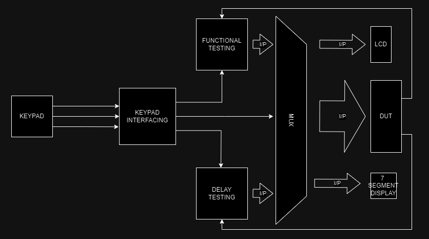
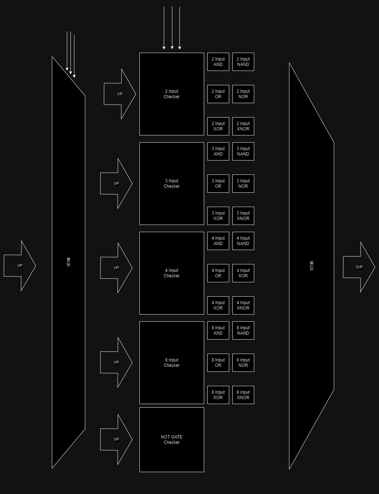
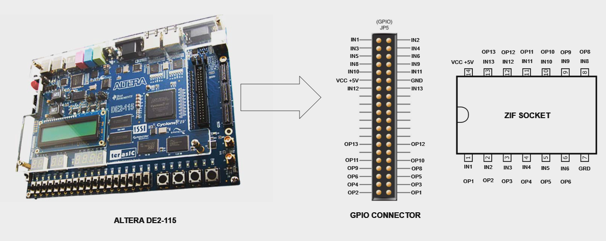

# Automated IC Testing Application using FPGA

Welcome to the Automated IC Testing Application Repository!

The key challenge is to distinguish faulty chips from good ones efficiently, especially for users in research and educational institutions who work with a limited range of digital ICs. Current digital IC testers on the market are often prohibitively expensive and support a wide array of ICs, making them impractical for this user base. These testers are typically not reprogrammable or customizable, forcing users to own multiple testers for different devices, which is costly and wasteful.

To address these issues, the project aims to develop a cost-effective, user-friendly, and reconfigurable digital IC tester based on FPGA technology. The primary focus is on cost-effectiveness and the ability to reconfigure input/output settings to accommodate various digital chips. This project aims to provide an affordable solution that caters specifically to the needs of users in research and education who work with a limited range of digital ICs.

This project aims to design a cost-effective, reconfigurable test instrument based on FPGA to test basic logic digital ICs. Adopting a software-defined approach, this project aims to develop a versatile and user-friendly tester for basic digital chips, providing a cost-effective test instrument for users to perform digital chip testing in research laboratories.

## Hardwear Components

- FPGA Board - Altera DE2-115
- IR Remote
- Jumper Wires
- ZIF Socket
- DUT (Some ICs)

## Technology Stack

- FPGA Development Board: ALtera DE2-115
- HDL: Verilog (Hardware Description Language)
- FPGA Synthesis Tool: Quartus II
- Simulation Tool: MultiSim
- Version Control: Git

## Bill of Materials (BOM)

| Component Name       | Quantity | Unit Cost(LKR) | Cost(LKR) |
| -------------------- | -------- | -------------- | --------- |
| FPGA Board EP1C3T144 | 1        | 16000          | 16000     |
| Jumper Wires         | 30       | 8              | 240       |
| ZIF Socket           | 1        | 120            | 120       |
| Testing ICs          | 5        | 100            | 500       |
| Total Cost           |          |                | 16860     |

## Solution Architecture

1. There is a Zero Insertion Force (ZIF) Socket to configure the IC.
2. The FPGA takes the IC number as the User Input through its IR Sensor Module.
3. Then, fetch the related data belonging to that particular IC. That data includes testing patterns, pin configurations, and all required other data.
4. Then the FPGA tests the IC with the testing pattern and compares the expected output.
5. Finally, display the result and if there is an error indicate the gate that has an error in the LCD board and the Seven Segment display of the FPGA.

## Schematics and Diagrams

The primary model consists of a KEYPAD, TESTING modules, LCD, SEVEN SEGMENT, and a DUT. Those modules are connected with each other in the following format. The DELAY TESTING module is an extra module and it will be implemented in a later step.

The design of this tester supports 14-pin DIP basic digital logic ICs from the 74 series TTL and CMOS family. The devices tested in this project are 74LS32, 74LS00, 74LS02, 74LS08, 74LS86 and 74LS386. The testing model used will be based on the functional fault.

## Assembly Instructions

The assembly instructions are as follows. You need to connect the corresponding pins of the GPIO connector to the ZIF Socket as shown in the following figure. Then you can start the FPGA board.

## Setup and Configuration

## Usage

## Testing and Troubleshooting

## Power Requirements

## Safety Considerations

## Contact Information

## Acknowledgments

## References
